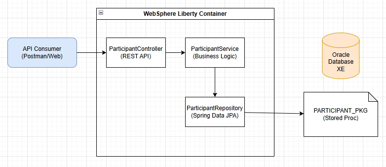
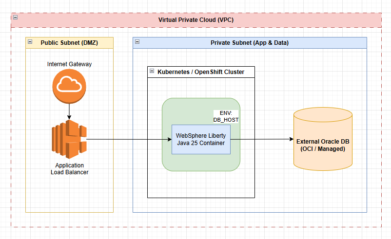
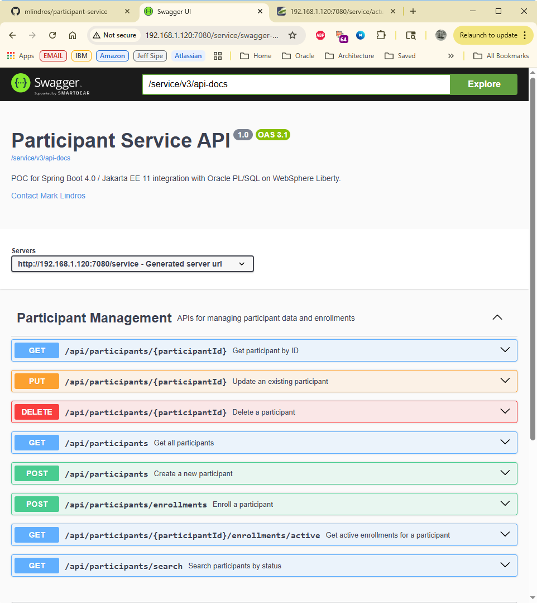
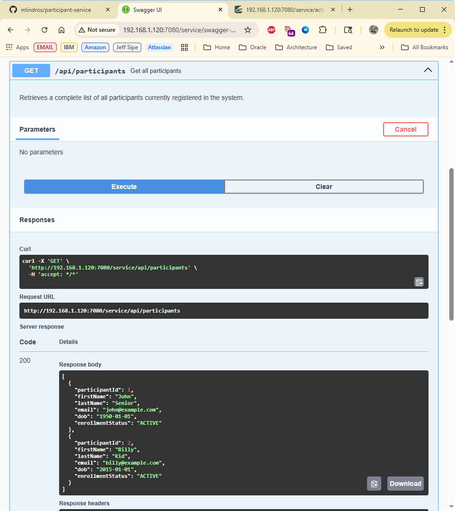
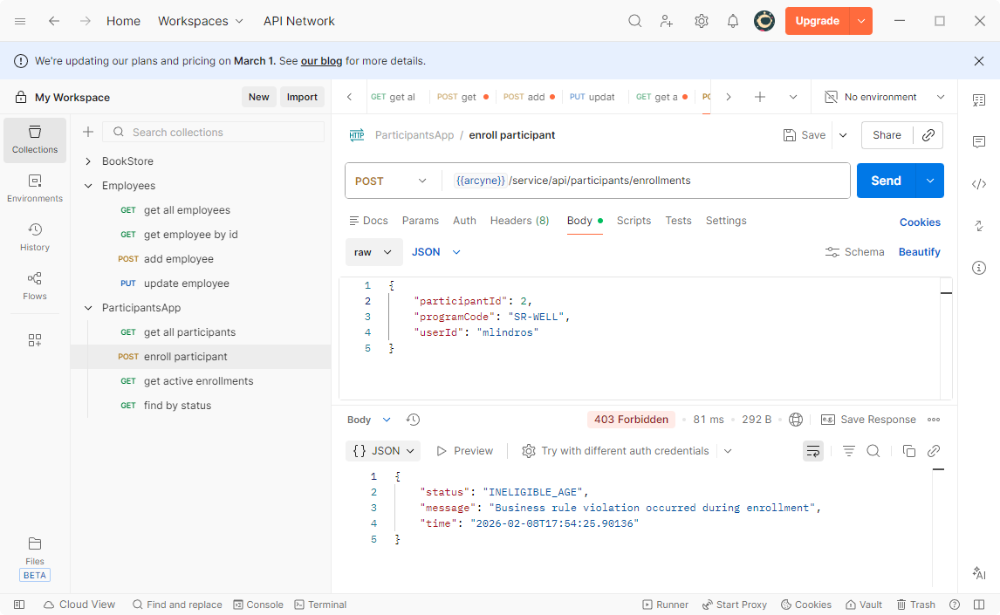
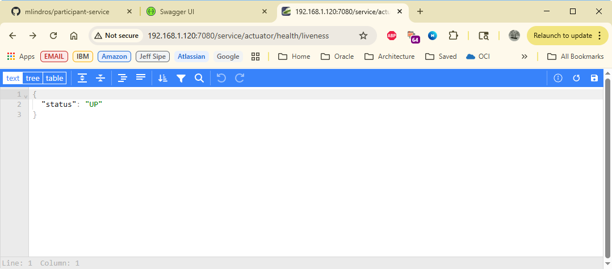

# Participant Microservice

## Project Overview
This project is a proof of concept Participant Management API built with Java 25 and Spring Boot. It serves as a showcase for modern backend architecture, demonstrating how to build a scalable, secure, and portable microservice. The application is specifically designed to run on WebSphere Liberty and is fully containerized with Docker, featuring an environment-aware configuration that transitions seamlessly between local development and cloud deployments.

## Tech Stack
* **IDE:** Intellij Community Edition 2025.3.2
* **Language:** Java 25 (utilizing latest syntax and performance features)
* **Framework:** Spring Boot 4.x (Only 3.0 supported in current WebSphere Liberty binary)
* **Runtime:** WebSphere Liberty 10-26.0.0.1 (Open Liberty) (Jakarta EE 10)
* **Database:** Oracle Database XE 21c (accessible at port 1521)
* **Security:** OAuth2 and OpenID Connect integration
* **Documentation:** OpenAPI 3.0 / Springdoc-openapi
* **Containerization:** Docker 2.6.3
* **Build Tool:** Maven 3.9+
* **SQLDeveloper:** 24.3
* **git:** 2.53.0
* **Postman:** 11.83.2

## Architecture and Design Patterns
The project is built following **SOLID principles** and a **Clean Architecture** approach:
* **Layered Abstraction:** Controllers handle web requests, Services contain business logic, and Repositories manage data persistence
* **Data Transfer Objects (DTO):** Request and Response mapping is performed at the Service layer to ensure the internal Data Model is never exposed directly to the API consumer
* **Centralized Exception Handling:** A Global Exception Handler captures custom exceptions to provide consistent, user-friendly JSON error responses
* **Dependency Injection:** Full utilization of Spring's IoC container for decoupled and testable components





## Key Features
### Modern Java Development
* **Functional Programming:** Uses Streams, Lambdas, and Method References
* **Simplified Syntax:** Uses Java 25 features such as `.toList()` instead of verbose collectors
* **Data Carriers:** Implementation of Java **Records** for immutable DTOs
* **Null Safety:** Strict use of **Optionals** to prevent NullPointerExceptions

### Advanced Data Persistence (JPA & Oracle)
* **Complex Mapping:** Implementation of `ManyToOne` and `OneToMany` relationships with optimized **Lazy fetching**
* **Database Logic:** Integration with **PL/SQL Stored Procedures** called directly via Spring Data JPA
* **Flexible Querying:** Use of **Named Queries** and Custom JPQL

### Cloud Native & DevOps
* **WebSphere Liberty Deployment:** Specialized configuration for lightweight high-performance
* **Dockerized Setup:** Fully containerized environment with advanced networking
* **Portable Configuration:** A single `server.xml` that uses variable injection to handle different DB hosts automatically

## Folder Structure
* `src/main/java`: Core application source code organized by layer (Controller, Service, Repository, DTO, Exception)
* `src/main/resources`: Application properties and static configurations
* `src/main/liberty/config`: Contains `server.xml` for Liberty-specific runtime settings
* `src/main/test`: Contains unit and integration tests using JUnit 5 and Mockito to ensure business logic correctness
* `Dockerfile`: Container image definition. Multi-stage build incorporates Liberty directly
* `pom.xml`: Maven build file containing dependency management and environment properties
```
com.example.participantservice
├── config                            # Infrastructure: System-wide setup (JNDI, Beans)
│   ├── security                      # OAuth2: SecurityConfig, JWT Converters, and CORS rules
│   │   └── WebSecurityConfig.java    # Configures the SecurityFilterChain, JWT decoding, and CORS policies
│   └── OpenApiConfig.java            # Configures Swagger/OpenAPI metadata and UI security schemes
├── controller                        # Web Layer: Entry point (Annotated with @PreAuthorize)
│   └── ParticipantController.java    # Manages REST endpoints and enforces method-level security
├── domain                            # Business Logic Core: The "Source of Truth"
│   ├── constant                      # System-wide constant values
│   │   └── AppConstants.java         # Centralized constant values for consistency and to avoid hard coding
│   └── entity                        # Persistence: JPA classes for Oracle (ManyToOne/Lazy)
│       ├── Participant.java          # JPA entity mapped to the main participant table
│       ├── Enrollment.java           # Entity managing participant program registrations
│       └── ProgramType.java          # Entity defining categories for available programs
├── dto                               # Data Transfer: API Contracts (Java Records)
│   ├── request                       # Input: Data from user
│   │   ├── ParticipantRequest.java   # Immutable record of the input contract and validation rules for participants
│   │   └── EnrollmentRequest.java    # Immutable record defining data required for program registration
│   └── response                      # Output: Data to user
│       ├── ParticipantResponse.java  # Immutable record defining the structured output contract for API consumers
│       ├── EnrollmentResponse.java   # Immutable record providing details of a participant's enrollment status
│       └── ErrorResponse.java        # Standardized record for returning detailed error information to clients
├── exception                         # Web Error Handling: Global Advice and JSON responses
│   ├── GlobalExceptionHandler.java   # Intercepts application errors to return standardized JSON response structures
│   ├── EnrollmentException.java      # Custom exception for handling program registration and enrollment failures
│   └── ParticipantException.java     # Custom exception for handling participant-specific business rule violations
├── mapper                            # Transformation: Decoupler (Entity <-> DTO)
│   ├── ParticipantMapper.java        # Provides stateless transformation logic to convert between Entities and DTOs
│   └── EnrollmentMapper.java         # Provides stateless transformation logic to convert between Entities and DTOs
├── repository                        # Data Access: Spring Data JPA
│   ├── ParticipantRepository.java    # Handles Oracle database abstraction and custom query execution for participants table
│   ├── EnrollmentRepository.java     # Handles Oracle database abstraction for enrollments table
│   └── ProgramTypeRepository.java    # Handles Oracle database abstraction for program_types table
├── service                           # Process Layer: Business workflows and Transactions
│   └── ParticipantService.java       # Executes business logic and maps data between controllers and repositories
├ ParticipantServiceApplication.java  # The main entry point that bootstraps the application and initializes component scanning
└ ServletInitializer.java             # Configures the application for deployment as a WAR file on traditional servers like WebSphere Liberty
```

## Links
* **REST API Base URL:** `http://localhost:7080/service/api/v1`
* **OpenAPI UI:** `http://localhost:7080/swagger-ui.html`
* **API Documentation (JSON):** `http://localhost:7080/v3/api-docs`
* **Aggregate Health Check:** `http://localhost:7080/service/actuator/health`
* **Liveness Health Check:** `http://localhost:7080/service/actuator/health/liveness`
* **Readiness Health Check:** `http://localhost:7080/service/actuator/health/readiness`
* **Metrics:** `http://localhost:7080/service/actuator/metrics`

## Environment Configurations
This project features a **Multiple Build Configuration** strategy to support developers and DevOps teams:

| Environment | Host Type | Connection Method |
| :--- | :--- | :--- |
| **Local IDE** | Physical Host | Connects via `localhost:1521` using Maven property injection. |
| **Docker** | Containerized | Connects via `host.docker.internal:1521` using environment variable overrides. |

## How to Build and Run

### 1. Clean the Project
Cleans the project and builds `service.war` file in `target` build folder.
```bash
./mvnw clean liberty:create package
```

### 2. Build the Docker Image
Uses the `Dockerfile` in the root of the project folder to build the Docker image:
* Uses `--no-cache` to force a full rebuild
* Uses `-t` to tag the image name and version as participant-service:1.0
* Uses `.` to specify the folder location (current directory) to use for creating the context for the Docker Daemon
```bash
docker build --no-cache -t participant-service:1.0 .
```

### 3. Run the Docker Container
Runs the Docker container from the image:
* Uses `-d` to detach terminal
* Uses `--rm` to clean up after stopping execution
* Uses `--name` to name the app container name
* Sets `-e DB_HOST` env variable to `host.docker.internal` to enable external calls to Oracle Database
* Exposes HTTP and HTTPs ports
* Specifies participant-service with tag version 1.0 to run
```bash
docker run --rm -d --name participant-app -e DB_HOST=host.docker.internal -p 7080:7080 -p 9443:9443 participant-service:1.0
```

### 4. Stop the Docker Container
Gracefully shuts down the running container.
```bash
docker stop participant-app
```

### 5. Force Clean Up (If Needed)
Manually removes the container instance from the Docker Host's process table. This is used if a previous run didn't exit cleanly and the container name `participant-app` is still "taken." This is usually not needed because running the container with the `--rm` option causes container to automatically clean up.
```bash
docker rm -f participant-app
```

---

## Technical Reference

### Database Schema (DDL)
This project requires the following tables in the `PARTICIPANT_APP` schema.

<details>
<summary><b>Click to expand SQL DDL</b></summary>

```sql
-- Main Participant Data
CREATE TABLE PARTICIPANTS (
    PARTICIPANT_ID NUMBER GENERATED BY DEFAULT AS IDENTITY PRIMARY KEY,
    FIRST_NAME VARCHAR2(50),
    LAST_NAME VARCHAR2(50),
    EMAIL VARCHAR2(100),
    DOB DATE,
    CREATED_BY VARCHAR(50) DEFAULT 'SYSTEM', 
    CREATED_ON TIMESTAMP(6) WITH TIME ZONE DEFAULT CURRENT_TIMESTAMP,
    UPDATED_BY VARCHAR(50) DEFAULT 'SYSTEM',
    UPDATED_ON TIMESTAMP(6) WITH TIME ZONE DEFAULT CURRENT_TIMESTAMP
);
-- Program Categories
CREATE TABLE PROGRAM_TYPES (
    PROGRAM_CODE VARCHAR2(20) PRIMARY KEY,
    PROGRAM_NAME VARCHAR2(100) NOT NULL,
    ELIGIBILITY_AGE NUMBER(3,0) DEFAULT 0,
    CREATED_BY VARCHAR(50) DEFAULT 'SYSTEM',
    CREATED_ON TIMESTAMP(6) WITH TIME ZONE DEFAULT CURRENT_TIMESTAMP,
    UPDATED_BY VARCHAR(50) DEFAULT 'SYSTEM',
    UPDATED_ON TIMESTAMP(6) WITH TIME ZONE DEFAULT CURRENT_TIMESTAMP
);

-- Enrollment Junction (Many-to-One)
CREATE TABLE ENROLLMENTS (
    ENROLLMENT_ID NUMBER GENERATED BY DEFAULT AS IDENTITY PRIMARY KEY,
    PARTICIPANT_ID NUMBER,
    PROGRAM_CODE VARCHAR(20),
    START_DATE DATE DEFAULT SYSDATE,
    EXPIRATION_DATE DATE,
    CREATED_BY VARCHAR(50) DEFAULT 'SYSTEM',
    CREATED_ON TIMESTAMP(6) WITH TIME ZONE DEFAULT CURRENT_TIMESTAMP,
    UPDATED_BY VARCHAR(50) DEFAULT 'SYSTEM',
    UPDATED_ON TIMESTAMP(6) WITH TIME ZONE DEFAULT CURRENT_TIMESTAMP,
    CONSTRAINT FK_PARTICIPANT FOREIGN KEY (PARTICIPANT_ID) REFERENCES PARTICIPANTS(PARTICIPANT_ID),
    CONSTRAINT FK_PROGRAM_TYPE FOREIGN KEY (PROGRAM_CODE) REFERENCES PROGRAM_TYPES(PROGRAM_CODE)
);
```

</details>

---

### PL/SQL Package Stored Procedure Code
This project uses the following PL/SQL code.

<details>
<summary><b>Click to expand PL/SQL package stored procedure code</b></summary>

```sql
create or replace PACKAGE PARTICIPANT_PKG AS
    /* Encapsulates business logic for Participant enrollment
     * and program eligibility.
     */
    PROCEDURE ENROLL_PARTICIPANT(
        p_participant_id IN NUMBER,
        p_program_code   IN VARCHAR2,
        p_user_id        IN VARCHAR2, -- Used for Audit Columns
        p_status_out     OUT VARCHAR2
    );
END PARTICIPANT_PKG;
/

create or replace PACKAGE BODY PARTICIPANT_PKG AS

    PROCEDURE ENROLL_PARTICIPANT(
        p_participant_id IN NUMBER,
        p_program_code   IN VARCHAR2,
        p_user_id        IN VARCHAR2,
        p_status_out     OUT VARCHAR2
    ) IS
        l_age         NUMBER;
        l_min_age     NUMBER;
        l_count       NUMBER;
    BEGIN
        -- 1. Fetch Participant Age
        SELECT floor(months_between(sysdate, DOB)/12)
          INTO l_age
          FROM PARTICIPANTS
         WHERE (PARTICIPANT_ID = p_participant_id);

        -- 2. Fetch Program Eligibility Requirement
        SELECT NVL(ELIGIBILITY_AGE, 0)
          INTO l_min_age
          FROM PROGRAM_TYPES
         WHERE PROGRAM_CODE = p_program_code;
        
        -- 3. Business Rule: Age Validation
        IF (l_age < l_min_age) THEN
            p_status_out := 'INELIGIBLE_AGE';
            RETURN;
        END IF;

        -- 4. Business Rule: Prevent Duplicate Enrollment
        SELECT count(*)
          INTO l_count
          FROM ENROLLMENTS
         WHERE (PARTICIPANT_ID = p_participant_id)
           AND (PROGRAM_CODE = p_program_code);
        
        IF (l_count > 0) THEN
            p_status_out := 'ALREADY_ENROLLED';
            RETURN;
        END IF;

        -- 5. Logic: Perform Enrollment with Audit Data
        INSERT INTO ENROLLMENTS (
            PARTICIPANT_ID,
            PROGRAM_CODE,
            START_DATE,
            EXPIRATION_DATE,
            CREATED_BY,
            UPDATED_BY
        ) VALUES (
            p_participant_id,
            p_program_code,
            SYSDATE,
            ADD_MONTHS(SYSDATE, 12),
            p_user_id,
            p_user_id
        );
        
        p_status_out := 'SUCCESS';

    EXCEPTION
        WHEN NO_DATA_FOUND THEN
            p_status_out := 'RECORD_NOT_FOUND';
        WHEN OTHERS THEN
            p_status_out := 'DB_ERROR: ' || SQLERRM;
    END ENROLL_PARTICIPANT;

END PARTICIPANT_PKG;
/
```

</details>

---

### Calling PL/SQL Stored Procedure From Java REST/JPA
The JPA layer uses the `@Procedure` annotation to configure the call to Oracle PL/SQL procedure.

<details>
<summary><b>Click to expand ParticipantRepository java code</b></summary>

```java
package com.example.participantservice.repository;

import com.example.participantservice.domain.entity.Participant;
import org.springframework.data.jpa.repository.Query;
import org.springframework.stereotype.Repository;
import org.springframework.data.jpa.repository.JpaRepository;
import org.springframework.data.jpa.repository.query.Procedure;
import org.springframework.data.repository.query.Param;

import java.util.List;

@Repository
public interface ParticipantRepository extends JpaRepository<Participant, Long> {

    @Procedure(name = "Participant.enroll")
    public String enrollParticipant(
            @Param("p_participant_id") Long participantId,
            @Param("p_program_code") String programCode,
            @Param("p_user_id") String userId
    );

    public boolean existsByEmail(String email);

    @Query("""
           select p from Participant p where lower(p.enrollmentStatus) like lower(concat('%', :status, '%'))
           """)
    public List<Participant> findByStatus(@Param("status") String status);
}
```

</details>

---

### `Participant.java` Entity Code for PL/SQL Stored Procedure Call
The JPA layer uses the `@NamedStoredProcedureQuery` annotation to configure the call to Oracle PL/SQL procedure.

<details>
<summary><b>Click to expand Participant java entity code</b></summary>

```java
package com.example.participantservice.domain.entity;

import com.fasterxml.jackson.annotation.JsonManagedReference;
import jakarta.persistence.*;

import java.time.LocalDate;
import java.time.OffsetDateTime;
import java.util.ArrayList;
import java.util.List;
import java.util.Objects;

@NamedStoredProcedureQuery(
        name = "Participant.enroll",
        procedureName = "participant_pkg.enroll_participant",
        parameters = {
                @StoredProcedureParameter(mode = ParameterMode.IN, name = "p_participant_id", type = Long.class),
                @StoredProcedureParameter(mode = ParameterMode.IN, name = "p_program_code", type = String.class),
                @StoredProcedureParameter(mode = ParameterMode.IN, name = "p_user_id", type = String.class),
                @StoredProcedureParameter(mode = ParameterMode.OUT, name = "p_status_out", type = String.class)
        }
)
@Entity
@Table(name = "PARTICIPANTS")
public class Participant {

    @Id
    @GeneratedValue(strategy = GenerationType.IDENTITY)
    @Column(name = "PARTICIPANT_ID", nullable = false)
    private Long participantId;

    @Column(name = "FIRST_NAME", length = 50)
    private String firstName;

    @Column(name = "LAST_NAME", length = 50)
    private String lastName;

    @Column(name = "EMAIL", length = 100)
    private String email;

    @Column(name = "DOB")
    private LocalDate dob;

    @Column(name = "ENROLLMENT_STATUS", length = 20)
    private String enrollmentStatus;

    @Column(name = "CREATED_BY", length = 50)
    private String createdBy;

    @Column(name = "CREATED_ON", updatable = false)
    private OffsetDateTime createdOn;

    @Column(name = "UPDATED_BY", length = 50)
    private String updatedBy;

    @Column(name = "UPDATED_ON", updatable = true)
    private OffsetDateTime updatedOn;

    @JsonManagedReference
    @OneToMany(mappedBy = "participant", cascade = CascadeType.ALL, orphanRemoval = true)
    private List<Enrollment> enrollments = new ArrayList<>();

    public Participant() {}

    //Boilerplate removed for brevity
}
```

</details>

---

### WebSphere Liberty `server.xml` Configuration File
This demonstrates the configuration required to blend our code to successfully deploy and run on WebSphere Liberty.

<details>
<summary><b>Click to expand `server.xml` configuration</b></summary>

```xml
<?xml version="1.0" encoding="UTF-8"?>
<server description="Participant App POC">

    <!-- Enable features --> 
    <featureManager>
        <feature>springboot-3.0</feature>
        <feature>servlet-6.0</feature>
        <feature>jdbc-4.3</feature>
        <feature>jndi-1.0</feature>
        <feature>localconnector-1.0</feature>
        <feature>expressionlanguage-5.0</feature>
    </featureManager>
    
    <basicRegistry id="basic" realm="BasicRealm"> 
        <!-- <user name="yourUserName" password="" />  --> 
    </basicRegistry>
    
    <!-- To access this server from a remote client add a host attribute to the following element, e.g. host="*" -->
    <httpEndpoint id="defaultHttpEndpoint"
                  host="*"
                  httpPort="7080"
                  httpsPort="9443" />
    
    <!-- Automatically expand WAR files and EAR files -->
    <applicationManager autoExpand="true" dropinsEnabled="false"/>

    <!-- Default SSL configuration enables trust for default certificates from the Java runtime --> 
    <ssl id="defaultSSLConfig" trustDefaultCerts="true" />
    
    <library id="OracleLib">
        <fileset dir="${shared.resource.dir}/jdbc" includes="ojdbc11*.jar"/>
    </library>

    <variable name="DB_HOST" defaultValue="localhost" value="${env.DB_HOST}"/>
    <dataSource id="ParticipantDS" jndiName="jdbc/ParticipantDS">
        <jdbcDriver libraryRef="OracleLib"/>
        <properties.oracle
                URL="jdbc:oracle:thin:@${DB_HOST}:1521/XEPDB1"
                user="PARTICIPANT_APP"
                password="oracle" />
        <connectionManager maxPoolSize="20" minPoolSize="2" connectionTimeout="30s" />
    </dataSource>

    <!-- Names built war file that contains the application -->
    <webApplication location="service.war" contextRoot="/service" />
</server>
```

</details>

---

### Wiring WebSphere Liberty via Maven `pom.xml` Build Configuration File
Maven `ojdbc11` dependency downloads the JDBC driver for the Oracle Database. The `liberty-maven-plugin` manages the server lifecycle and automatically injects the JDBC driver into the build.

<details>
<summary><b>Click to expand Maven Plugin configuration</b></summary>

```xml
<dependency>
    <groupId>com.oracle.database.jdbc</groupId>
    <artifactId>ojdbc11</artifactId>
    <version>23.6.0.24.10</version>
</dependency>

<plugin>
    <groupId>io.openliberty.tools</groupId>
    <artifactId>liberty-maven-plugin</artifactId>
    <version>3.10</version>
    <configuration>
        <serverName>defaultServer</serverName>
        <looseApplication>true</looseApplication>
        <deployPackages>project</deployPackages>
        <copyDependencies>
            <dependencyGroup>
                <location>../../shared/resources/jdbc</location>
                <dependency>
                    <groupId>com.oracle.database.jdbc</groupId>
                    <artifactId>ojdbc11</artifactId>
                </dependency>
            </dependencyGroup>
        </copyDependencies>
    </configuration>
</plugin>
```

</details>

---

### Wiring Spring Boot to WebSphere Liberty JNDI for Oracle DataSource Connection via `application.properties` File
WebSphere JNDI name for database datasource connection pool is mapped via the `application.properties` file.

<details>
<summary><b>Click to expand `application.properties` configuration</b></summary>

```properties
spring.application.name=participant-service

# 1. The Link to Liberty's DataSource
spring.datasource.jndi-name=jdbc/ParticipantDS

# 2. The Oracle Dialect (Crucial for Hibernate 6+ / Spring Boot 4)
spring.jpa.database-platform=org.hibernate.dialect.OracleDialect

# 3. Prevent Hibernate from trying to open a separate connection for metadata
spring.jpa.properties.hibernate.temp.use_jdbc_metadata_defaults=false

# 4. Disable DDL-Auto (since your table already exists)
spring.jpa.hibernate.ddl-auto=none

# 5. Show SQL (helpful for your learning/debugging phase)
spring.jpa.show-sql=true

# Show database status in the health check
management.endpoint.health.show-details=always
management.endpoints.web.exposure.include=health,info,metrics
management.endpoint.health.probes.enabled=true

```

</details>

---

### Docker Environment Definition
This `Dockerfile` defines the containerized environment, using the Universal Base Image (UBI) and Open Liberty runtime to package the application with its required JDBC drivers and configuration.

<details>
<summary><b>Click to expand `Dockerfile`</b></summary>

```dockerfile
FROM icr.io/appcafe/open-liberty:full-java25-openj9-ubi-minimal

USER root
# Create the target directory inside the image
RUN mkdir -p /opt/ol/wlp/usr/shared/resources/jdbc && \
    chown -R 1001:0 /opt/ol/wlp/usr/shared/resources/jdbc

USER 1001

# 1. Copy the server configuration
COPY --chown=1001:0 src/main/liberty/config/server.xml /opt/ol/wlp/usr/servers/defaultServer/server.xml

# 2. Copy the JDBC driver using a wildcard for the version
COPY --chown=1001:0 target/liberty/wlp/usr/shared/resources/jdbc/ojdbc11-*.jar /opt/ol/wlp/usr/shared/resources/jdbc/

# 3. Copy the WAR file
COPY --chown=1001:0 target/service.war /opt/ol/wlp/usr/servers/defaultServer/apps/service.war

# 4. Finalize the server (installs features like servlet-6.0)
RUN configure.sh
```

</details>

---

## Screenshots

### OpenAPI Landing Page
<kbd>

</kbd>

### OpenAPI GET `/api/participants`


### Postman POST `/api/participants/enrollments` Postman Enroll Participant via PL/SQL Stored Procedure


### Health Liveness via Actuator `http://localhost:7080/service/actuator/health/liveness`



---